# Real-Time AIS Vessel Intelligence with Microsoft Fabric

Turn raw AIS/NMEA vessel telemetry into structured, map-ready vessel intelligence using Microsoft Fabric Real-Time Intelligence and KQL.

This repository contains two implementation paths:

| Path | Use when | Main asset |
| --- | --- | --- |
| **Demo** | You want a fast, self-contained walkthrough with no Eventhouse ingestion setup. | `kql/demo/staten-island-ferry-inline-demo.kql` |
| **Production deployment** | You want an Eventhouse-ready schema with normalization, routing, decoding, and update policies. | `kql/production/create-eventhouse-schema-and-policies.kql` |
| **Production demo control** | You deployed the Eventhouse assets and want to reset, seed, validate, and render the production flow. | `kql/production/production-demo-control.kql` |

## Scenario

Automatic Identification System (AIS) receivers emit vessel telemetry as NMEA 0183 AIVDM/AIVDO sentences. Those messages are compact and efficient for transport, but not directly useful for analytics, operations dashboards, or geospatial visualization.

The solution in this repo keeps the original wire-format message, decodes AIS Class A position reports directly in KQL, and outputs structured columns such as MMSI, latitude, longitude, speed over ground, course over ground, heading, navigation status, and timestamp.

## Repository layout

```text
.
|-- README.md
|-- CONTRIBUTING.md
|-- SECURITY.md
|-- SUPPORT.md
|-- docs
|   |-- architecture.md
|   |-- demo-walkthrough.md
|   |-- production-deployment.md
|   `-- kql-reference.md
|-- kql
|   |-- demo
|   |   `-- staten-island-ferry-inline-demo.kql
|   `-- production
|       |-- create-eventhouse-schema-and-policies.kql
|       `-- production-demo-control.kql
|-- samples
|   `-- staten-island-ferry
|       `-- README.md
`-- assets
    `-- README.md
```

## Quick start

1. Open a KQL query window in Microsoft Fabric.
2. Paste and run `kql/demo/staten-island-ferry-inline-demo.kql`.
3. Review the decoded vessel positions and map visualization.
4. When ready for a deployed implementation, follow `docs/production-deployment.md`.
5. To demonstrate the deployed Eventhouse pipeline, run selected blocks from `kql/production/production-demo-control.kql`.

The demo uses valid AIS AIVDM sample sentences derived from public NOAA AIS data and does not require an Eventhouse, Eventstream, Event Hub, or external parser.

## Production flow

```mermaid
flowchart LR
    Source[AIS receiver, Eventstream, Event Hub, Kafka, or file ingest]
    Raw[AisRaw - bronze]
    Normalize[NormalizeAis update policy]
    Silver[AisNormalized - silver]
    Route[Routing update policies]
    Gold[AIS category tables - gold]
    Decode[DecodeAisClassAPosition update policy]
    Positions[AisDecodedClassAPosition]
    BI[Power BI, Real-Time Dashboard, maps, operations]

    Source --> Raw --> Normalize --> Silver --> Route --> Gold --> Decode --> Positions --> BI
```



See `docs/architecture.md` for the logical design and `docs/kql-reference.md` for the main functions and tables.

## What this demonstrates

- Preserve raw AIS messages exactly as received.
- Parse NMEA envelopes and classify AIS message types in KQL.
- Decode AIS six-bit armored payloads without Python, custom services, or external parsers.
- Convert encoded coordinates into decimal latitude and longitude.
- Route normalized messages into gold tables for position, static, infrastructure, binary, safety, and control categories.
- Use update policies to automate the bronze-to-silver-to-gold flow in Fabric Eventhouse.

## Demo data source, support, and safety notice

This is a sample implementation for learning and demonstration. It is not an official Microsoft product, service, or support offering unless published through an approved Microsoft channel with the appropriate review.

The sample data is derived from NOAA's public AIS archive for 2024: https://coast.noaa.gov/htdata/CMSP/AISDataHandler/2024/

Sample records are historical public AIS data prepared for analytics demonstration only. They must not be used for navigation, collision avoidance, vessel operations, emergency response, or safety-of-life decisions.

## Before publishing

Before pushing this repository publicly:

1. Choose and add the appropriate open-source license for your organization.
2. Confirm the NOAA data attribution and sample preparation notes are acceptable for your publishing process.
3. Remove tenant-specific endpoints, private workspace names, connection strings, and credentials.
4. Replace any customer-specific screenshots with approved public assets.
5. Follow your organization's open-source, trademark, privacy, and accessibility review process.
